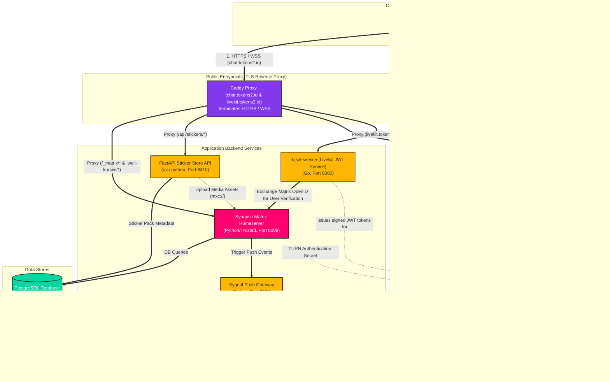

# majoin

LINE-style chat over [Matrix](https://matrix.org). Flutter client (Android,
iOS, macOS, Windows, Linux) on a self-hosted Synapse homeserver.

## Repository layout

```
majoin/
├── client/        Flutter app (the end-user chat client)
├── services/      Standalone backend APIs we write
│   └── sticker-api/   FastAPI sticker store (catalog + admin)
├── appservices/   Matrix Application Services (registered AS — bridges, puppeting)
├── bots/          Simple Matrix bots (plain user-account bots)
├── infra/         Matrix deploy + reverse proxy
│   ├── synapse/       homeserver config + data
│   ├── coturn/        TURN server config
│   ├── sygnal/        push gateway config
│   ├── caddy/         Caddyfile reference
│   ├── systemd/       unit files
│   └── scripts/       bootstrap.sh, register-user.sh
├── tools/         Dev tooling (asset generators)
│   └── sticker-gen/   sticker placeholder PNG generators
└── docs/          Architecture notes, runbooks
```

### What goes where

| Dir | Definition | Examples |
|-----|------------|----------|
| `client/` | end-user application | Flutter app |
| `services/` | standalone REST APIs, not tied to Matrix protocol | sticker-api |
| `appservices/` | Matrix Application Services — registered, own a user namespace, can masquerade users | LINE↔Matrix bridge, puppeting |
| `bots/` | bots that log in as a normal user and react | welcome-bot, broadcast-bot |
| `infra/` | deploy config for the Matrix stack + reverse proxy | Synapse, coturn, sygnal, Caddy |
| `tools/` | dev-time scripts, never deployed | asset generators |

**bot vs appservice:** a *bot* is one ordinary user account that logs in and
reacts. An *appservice* is registered with Synapse via a registration file,
gets a user-id namespace, and can act on behalf of many users — required for
bridges and puppeting.

## Production setup (current)

- Homeserver: `https://chat.tokens2.io` (Synapse, native install on VPS)
- Reverse proxy: Caddy (`/_matrix/*`, `/api/stickers/*`)
- TURN: coturn (native)
- Sticker store: `services/sticker-api` (FastAPI, systemd, port 8410)

### Infrastructure Architecture


<details>
<summary>Show Mermaid Source</summary>


</details>

## Quick start (client dev)

```bash
cd client
flutter pub get
flutter run -d macos        # or any connected device
```

Login screen points at `https://chat.tokens2.io` (hardcoded in
`client/lib/core/config.dart`). Register in-app or via:

```bash
# on the homeserver
sudo register_new_matrix_user -c /etc/matrix-synapse/homeserver.yaml \
    http://localhost:8008
```

## Features

| Area | Status |
|------|--------|
| Login / register (password) | done |
| DM + group rooms | done |
| Text / image / video / audio / file messages | done |
| Stickers + sticker store API | done |
| LINE Flex Message renderer (3 demos) | done |
| Reply / copy / unsend / forward / edit | done |
| Reactions, read receipts, typing indicator | done |
| History pagination, room search | done |
| E2EE: recovery key, cross-signing, key backup, device verification | done |
| 1:1 voice + video call (WebRTC + coturn) | wired, MVP |
| TH / EN localization | done |
| Push — local notifications (all platforms) | done |
| Push — FCM / APNs remote (background/killed) | wired; needs Firebase config |
| Group call (LiveKit) | planned (Phase 2) |

## Component docs

- `services/sticker-api/README.md` — sticker store API deploy + pack upload
- `infra/scripts/` — Synapse bootstrap + user registration
- `docs/push-setup.md` — FCM remote push setup (Firebase + sygnal)
